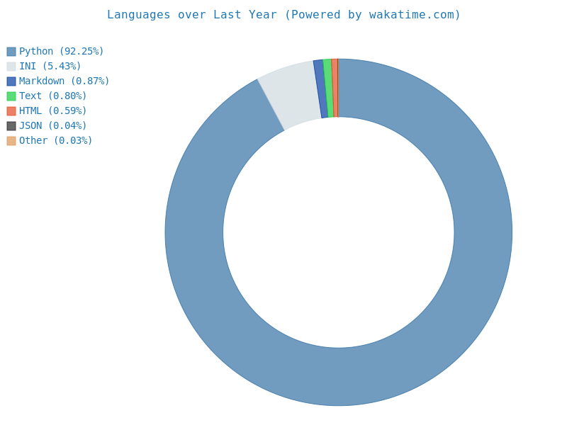
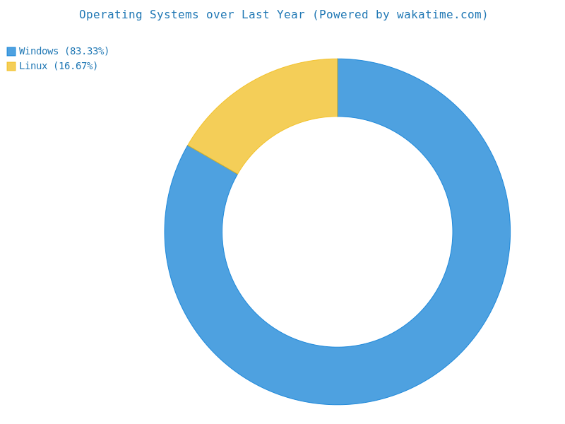

# Hey there! 👋

👋 Hi, I'm Andrew, a US-based freelance software developer with a passion for coding, creativity, and problem-solving. I'm enthusiastic about learning new technologies and enjoy reading webnovels in my free time. I specialize in using tech to bring ideas to life and thrive on challenges. Check out my cool stats below!

 
Weekly Dev Breakdown

  

 
Operating Systems Uptime Breakdown

  

## 🌐 Let's Connect  📫 

Whether you want to team up, geek out on tech trends, or simply say hi, you can reach out to me through the following channels:

